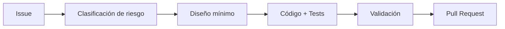

# Workflow: Issue → PR

1. Crear issue con objetivo, alcance y criterios de aceptación.
2. Clasificar riesgo (`risk/*`) y nivel L0-L3.
3. Confirmar contratos y dependencias con `freak-days-api` si aplica.
4. Crear rama desde base vigente del repositorio.
5. Implementar en incrementos chicos con validación continua.
6. Ejecutar checklists relevantes (`pre-implementation`, `pre-pr`, seguridad si corresponde).
7. Correr quality gates bloqueantes (`pnpm lint`, `pnpm typecheck`, `pnpm test`).
8. Abrir PR con:
   - contexto del problema
   - solución propuesta
   - evidencia de validación
   - riesgos/mitigaciones/rollback
9. Resolver review y observaciones.
10. Mergear según estrategia acordada y cerrar issue.

## Mermaid sugerido para PR/issue

